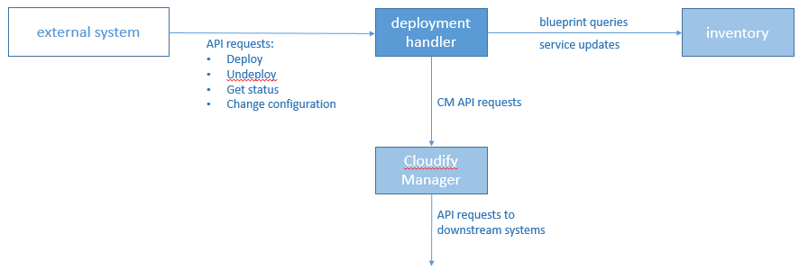

### DCAE Deployment Handler

The DCAE Deployment Handler (DH) is the interface to DCAE's orchestration system.  The DH exposes an HTTP-based API that allows client systems to request the deployment of DCAE services based on service blueprints stored in the DCAE inventory, as well to check the status of deployments and to request undeployment of a previously-deployed service.  The API is documented here [here](./dispatcherAPI.yaml)

The diagram below shows the DH's place in the DCAE orchestration system.

#### Building the Deployment Handler
The Deployment Handler is packaged as a Docker image.  The [Dockerfile](./Dockerfile) can drive a Docker build (using the `docker build` command) from the top-level directory of this repository.

To incorporate git information about the current tag and commit into the code, run the `set_version.sh` script to generate a new `version.js` file before doing the Docker build.  (The script uses `git describe --long --always` to get the version information.)

When building an image intended as a release candidate or a released product, it's important to freeze all of the dependencies.  Use the `npm shrinkwrap` command to freeze the dependencies, and commit the resulting `npm-shrinkwrap.json` file.  